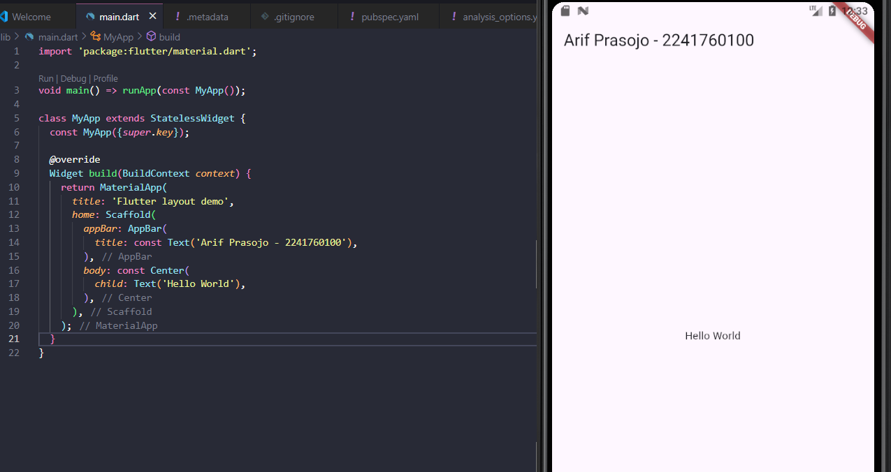
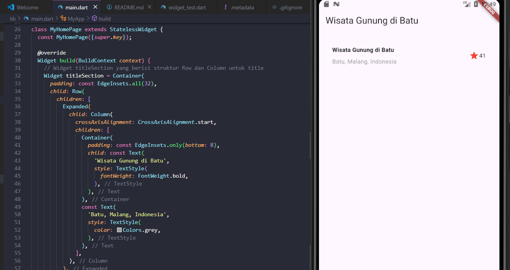

# Praktikum Flutter 06 | Layout dan Navigasi

## Identitas
- **NIM**: 2241760100
- **Nama**: Arif Prasojo.
- **Kelas**: SIB - 3E

## Hasil Akhir 

### 1. **Praktikum 1: Membangun Layout di Flutter**
1. Buka file main.dart lalu ganti dengan kode berikut. Isi nama dan NIM Anda di text title.

2. Implementasi title row : Pertama, Anda akan membuat kolom bagian kiri pada judul. Tambahkan kode berikut di bagian atas metode build() di dalam kelas MyApp:

### 2. **Text Widget**

### 3. **Image Widget**

### 4. **Cupertino Button dan Loading Bar**

### 5. **Floating Action Button (FAB)**

### 6. **Scaffold Widget**

### 7. **Dialog Widget**

### 8. **Input dan Selection Widget**

### 9. **Date and Time Pickers**
