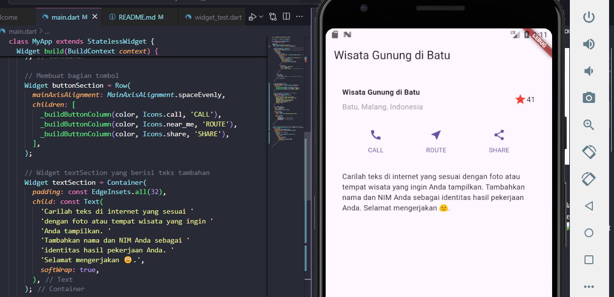

# Praktikum Flutter 06 | Layout dan Navigasi

## Identitas
- **NIM**: 2241760100
- **Nama**: Arif Prasojo.
- **Kelas**: SIB - 3E

## Hasil Akhir 

### 1. **Praktikum 1: Membangun Layout di Flutter**
1. Buka file main.dart lalu ganti dengan kode berikut. Isi nama dan NIM Anda di text title.

2. Implementasi title row : Pertama, Anda akan membuat kolom bagian kiri pada judul. Tambahkan kode berikut di bagian atas metode build() di dalam kelas MyApp:

### 2. **Praktikum 2: Implementasi button row**
1. Buat method Column _buildButtonColumn : Bagian tombol berisi 3 kolom yang menggunakan tata letak yang sama—sebuah ikon di atas baris teks. Kolom pada baris ini diberi jarak yang sama, dan teks serta ikon diberi warna primer.
Karena kode untuk membangun setiap kolom hampir sama, buatlah metode pembantu pribadi bernama buildButtonColumn(), yang mempunyai parameter warna, Icon dan Text, sehingga dapat mengembalikan kolom dengan widgetnya sesuai dengan warna tertentu.

2. Buat widget buttonSection : Buat Fungsi untuk menambahkan ikon langsung ke kolom. Teks berada di dalam Container dengan margin hanya di bagian atas, yang memisahkan teks dari ikon.
Bangun baris yang berisi kolom-kolom ini dengan memanggil fungsi dan set warna, Icon, dan teks khusus melalui parameter ke kolom tersebut. Sejajarkan kolom di sepanjang sumbu utama menggunakan MainAxisAlignment.spaceEvenly untuk mengatur ruang kosong secara merata sebelum, di antara, dan setelah setiap kolom. Tambahkan kode berikut tepat di bawah deklarasi titleSection di dalam metode build():

3. Tambah button section ke body : Tambahkan variabel buttonSection ke dalam body seperti berikut:

### 3. **Praktikum 3: Implementasi text section**
1.  Buat widget textSection : Tentukan bagian teks sebagai variabel. Masukkan teks ke dalam Container dan tambahkan padding di sepanjang setiap tepinya. Tambahkan kode berikut tepat di bawah deklarasi buttonSection:

2. Tambahkan variabel text section ke body : Tambahkan widget variabel textSection ke dalam body seperti berikut:

### 4. **Praktikum 4: Implementasi image sectionr**
1. Siapkan aset gambar : 
Anda dapat mencari gambar di internet yang ingin ditampilkan. Buatlah folder images di root project layout_flutter. Masukkan file gambar tersebut ke folder images, lalu set nama file tersebut ke file pubspec.yaml seperti berikut:

2. Tambahkan gambar ke body :
Tambahkan aset gambar ke dalam body seperti berikut:

3. Terakhir, ubah menjadi ListView :
Pada langkah terakhir ini, atur semua elemen dalam ListView, bukan Column, karena ListView mendukung scroll yang dinamis saat aplikasi dijalankan pada perangkat yang resolusinya lebih kecil.

### **Tugas Praktikum 1**

### 6. **Scaffold Widget**

### 7. **Dialog Widget**

### 8. **Input dan Selection Widget**

### 9. **Date and Time Pickers**
